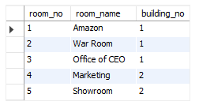

# SQL

# 1.Простые запросы
## SELECT (1.1)
Конструкция Select
~~~
Select * From products
~~~
где * - это все столбцы таблицы
## Where (1.2)
Where - оператор для отбора по критерию. 
~~~
Select name, price from products where price >= 10000
~~~
Выбираем только name и price из таблицы, . Доп условие что price < 3000

Можно указать наоборот, чтобы критерий НЕ был равен, для этого нужно использовать !=

Для сравнения тексовых полей необходимо использовать кавычки ''
~~~
Select * From orders Where status != 'cancelled'
~~~
Если имеется множество условий их можно написать через OR,
~~~
Select * From orders 
where status = 'cancelled' OR status = 'returned'
~~~
 но это будет громоздко, поэтому будем использовать оператор in
~~~
Select * From orders where status in( 'cancelled', 'returned')
~~~
результат запроса: все записи где статус равен cancelled и returned 

| id | user_id | products_count | sum   | status    |

+----+---------+----------------+-------+-----------+

| 2  | 18      | 1              | 200   | cancelled |

| 6  | 1       | 2              | 7690  | cancelled |

| 10 | 13      | 7              | 13000 | returned 
## Множественные усовия
## IN
Запрос удаляет все  записи у которых id =3,4,7
~~~
delete from orders 
 where id in (3,4,7);
~~~
Тоесть IN проверяет есть ли значения которе в скобках в таблице
## OR (1.3)
Оператор OR соответствует логическому ИЛИ. В данном случае результатом запроса будут все записи подходящие ИЛИ под одно ИЛИ под другое условие
~~~
Select * From orders where sum > 3000 or products_count >= 3
~~~
## AND (1.4)
And соответствует логческому И, результатом запроса будут записи удовлетворяющие сразу двум запросам 
~~~
Select * From orders where sum >= 3000 AND products_count < 3
~~~
## Between (1.5)
Between это оператор для выборки в определенном диапозоне чисел.

При этом он отсеивает сами границы , тоесть записи где sum=3000 и sum=10000, не попадут в сисок.
~~~
Select * From orders where sum between 3000 and 10000 AND status = 'cancelled'
~~~
## NOT (1.6)
NOT инвертирует любой оператор
~~~
Select * from orders where not sum between 3000 and 10000 and status ="cancelled" 
~~~
В данном случае результатом будут все аписи НЕ входящие в промежуток от 3 до 10 тысяч.
И удовлеворяющие условию status ="cancelled" 

| id | user_id | products_count | sum   | status    |

+----+---------+----------------+-------+-----------+

| 3  | 45      | 3              | 800   | cancelled |

| 11 | 13      | 7              | 13000 | cancelled |

## Порядок OR и AND (1.7)
У AND приоритет выполнения перед OR.
Тоесть сначала выпоняется AND а потом OR.
~~~
Select * From team 
Where basic_languadge='python'  OR
basic languadge = 'php'  AND level ='middle' 
~~~
Логика верхнего запроса такова: нужно отправить таблицу с разработчиками php, у которых middle уровень знаний ИЛИ всех разработчиков на python
~~~
Select * From team 
Where (basic_languadge='python'  OR
basic languadge = 'php')  AND level ='middle' 
~~~
Логика нижнего запроса: ищем всех разработчиков на питоне или php И тех из них кто имеет средний уровень разработки.
Как видно из второго запроса, тут  как в математике, очередность меняется если поставить скобк, что в скобках то  выполняется первым.
# Сортировка
## Order by (1.8)
 Это сортировка запросов по одноу из полей от меньшего к большему. С начала и до конца алфавита от более ранней даты к более поздней от самой маленькой зарплаты к самой большой и т.д
 ~~~
 Select * From products order by price
 ~~~
Результат:
| id | name              | count | price |

+----+-------------------+-------+-------+

| 5  | Вентилятор        | 0     | 700   |

| 7  | Тостер            | 2     | 2500  |

| 8  | Принтер           | 4     | 3000  |

| 3  | Микроволновка     | 3     | 4000  |

| 4  | Пылесос           | 2     | 4500  |

| 1  | Стиральная машина | 5     | 10000 |

| 2  | Холодильник       | 0     | 10000 |

| 6  | Телевизор         | 7     | 31740 |
  Если добавить Desc, то сортировка произойдет в обртном направлени
~~~
Select name, price from products order by price desc
~~~
Результат:
 name              | price |

+-------------------+-------+

| Телевизор         | 31740 |

| Стиральная машина | 10000 |

| Холодильник       | 10000 |

| Пылесос           | 4500  |

| Микроволновка     | 4000  |

| Принтер           | 3000  |

| Тостер            | 2500  |

| Вентилятор        | 700   |

Также можно сортировать сразу по нескольким полям перечисляя их через запятую. Сначала база будет сортироваться по первому полю которое мы вписали, потом по второму. 

Мы можем также инвертировать отдельное поле при сортировке дописав к нему desc.

~~~
Select * From users 
where salary >= 40000 
order by salary desc, first_name
~~~
| id | first_name | last_name | birthday   | salary | job                 |

+----+------------+-----------+------------+--------
+---------------------+

| 7  | Александр  | Пузаков   | 2002-02-20 | 120000 | ведущий программист |

| 5  | Алена      | Шикова    | 1999-08-17 | 53000  | фотограф            |

| 2  | Ольга      | Антонова  | 1999-12-01 | 41000  | дизайнер            |

| 8  | Алина      | Антонова  | 2002-01-01 | 40000  | верстальщик         |

| 3  | Сергей     | Васильев  | 2002-02-20 | 40000  | младший программист |

# Ограничение выборки
## limit (1.9)
если limit 5 ; то показываются только первые 5 записей, если limit 10, 5; то НЕ показываются первые 10 и показываются следующие после этих 10 ти 5
~~~
 Select * from products order by price  limit 10,5
~~~

# 2. Добавление, изменение, удаление, данных
создание - insert;

чтение - select;

удаление - Deleate или Truncate ;

обновление - update;
# Добваление
## insert into (2.1) 
https://stepik.org/lesson/206836/step/7?thread=solutions&unit=180537
## Values
isert into- добавляет строки таблицы;

orders - имя таблицы в которую вставляют данные  ;

id , products , sum -поля таблицы
~~~
insert into orders (id, products, sum)
values (6,3, 3000)
~~~
'(id, products, sum)'- эта часть отвечает за состав  порядок вставки в таблицу.

Если мы напишем (id, sum) и вставим (7,10000), то поле sum у этой записи будет пустым.

Числа не нужно добавлять в кавычки а текст и даты нужно.
Формат записи даты может быть другим в завсимости от используемого.
~~~
insert into products (id, name, count, price)
values
(8,'iPhone 7', 1,59990),
(9,'iPhone 8', 3, 64990),
(10,'iPhone X', 2, 79900);
~~~
(id, name, count, price) Эту часть тоже можно не писать.

## set (2.2) 
set имеет следующую конструкцию

INSERT INTO table SET field1=value1, field2=value2;
~~~
insert into users 
set id=10,first_name='Никита', last_name= 'Петров';
~~~

## update (2.3) 
update -  преднаначен для изменения полей таблицы, products это имя таблицы, set задает полю name занчение iMac, в той аписи где id = 7
~~~
Update products set name = 'iMac' where id =7;
~~~
~~~
Update films set rating = (kinopoisk+imdb)/2
~~~
## set (2.4) 
set - это как и какие мы изменяем поля мы изменяем поля:
~~~
Update users set 
salary=salary*1.1 where salary < 20000
~~~

## NULL (2.5) 
NULL – это особое слово в MySQL и в отличии от "cancelled" или "new", его нужно писать без кавычек.
А чтобы сравнить значение в поле с NULL, нужно использовать не символы равенства (=) и неравенства (<> или !=),
а специальное выражение IS NULL или IS NOT NULL.
~~~
update orders set status='new' 
where status is NULL
~~~
Здесь такая же ситуация для where как и в select, можно стоавить несколько условий через  OR или AND
~~~
update orders set amount=sum*products_count 
where amount =0 or amount is null
~~~
~~~
update products set count = count + 40 where name= 'Марс' or name = 'Сникерс' 
~~~
Можно задавать поля чтобы они не были равны NULL
~~~
create table cars(
 id int NOT NULL,
 mark Varchar(20) NOT NULL,
 model Varchar(20) NOT NULL,
 year year, 
 mileage mediumint unsigned
);
~~~
При этом если мы вставим в такое значение '', то будет показываться null, но это будет пустая строка. NULL это ничто,пустая ячейка данных. Допустим мы хотим найти всех немужчин в таблице(варианты: m, w, пустая строка, и NULL )
~~~
select * From users 
 where sex <> m; 
~~~
Нам выдадаст всех женжин и людей у которых пустая строка вместо пола.Если нужно найти и Null в том числе запрос будет следующий
~~~
select * From users 
 where sex <> m or sex is NULL
~~~

## limit (2.6) 
Тут все также как и в select, можно задать направление исполнения комманды с помощбю desc, и задать параметры, а также установить лимит
~~~
update products set price = price*1.05 
order by price desc limit 5
~~~

## (2.7) Delete
Удаляет толбцы из таблицы. К delete применимы те же принципы что и к select, update, insert 
~~~
delete from cars 
where country = 'JP' and (power >129 or power < 79)
~~~

# 3.Создание таблиц
boolean в mysql НЕ существует, при попытке его добавить, добавляется tinyint c значениями 0 или 1 
## Create (3.1)
Создает таблицу (в даном случае messages )где id и т.д это поля.

ПОСЛЕ ПОСЛЕДНЕГО ПОЛЯ НЕ НУЖНА ЗАПЯТАЯ!

(inset into добавляет данные в таблицу)
~~~
Create table messages (
 id int,
 subject Varchar(100),
 message text,
 add_date Datetime,
 is_public bool
 );
insert into messages (id, subject, message, add_date, is_public)
 values 
 (1, 'Первое сообщение','Это мое первое сообщение!', '2016-12-12 14:16:00', true);
~~~
~~~
create table rating (
 id int,
 car_id int,
 user_id int,
 rating float
);
insert into rating ( id,car_id, user_id, rating)
 values
 (1,1,1,4.54),
 (2,1,2,3.34),
 (3,2,3,4.19),
 (4,2,11,1.12);
~~~

## unsigned (3.3) 
В int храняться числа от -2147483648  до + 2147483647.

Там где мы не используем минусоые значения используем unsigned, чтобы исключить хранение минусовых значений

~~~
id int unsigned;
age tinyint unsigned 
~~~
Теперь диапозон int будет равен от 0 до 4294967296,а tinyint от 0 до 255
~~~
create table films (
    id INT unsigned,
    name varchar (100),
    rating float unsigned,
    country varchar (2)
);
insert into films (id, name, rating, country)
 Values
 (1,'Большая буря', 3.45,'RU'),
 (2,'Игра', 7.5714,'US'),
 (3,'Война', 10.0,'RU');
~~~
## Decimal (3.4)
~~~
amount Decimal (10,2)
~~~
Где 10 максимальное число знаков в числе, 
а 2 после запятой. 

Максиальное число в данном случае - 8мь девяток до запятой и две после запятой: 99999999.99

Если вставлять числа после запятой, то происходит округление

## Строковые поля
~~~
'\'Хорошее'\' кино\n про упорстово' =

'Хорошее' кино

про упорство
 ~~~
## Varchar  (3.5)  
 Varchar это строковый тип данных в ктором максимальное значение символов 65535 символов.
Лучше не ставить индекс у varchar больше чем нужно. Например не будет имя человека больше 20 ти символов, а фамилии больше 50. 

## Text (3.6) 
Text - фиксировынный текстовой тип писать скобки не нужно, выдаст ошибку.
~~~
Create table users(
 id INT unsigned,
 first_name Varchar (50),
 last_name Varchar (60),
 bio text 
);

insert into users (id, first_name, last_name, bio)
 Value
 (1,'Антон','Кулик','С отличием окончил 39 лицей.'),
 (2,'Сергей','Давыдов',''),
 (3,'Дмитрий', 'Соколов','Профессиональный программист.');
 Select * From users
~~~
Text - 65535
Mediumtext - 16777215
Longtext - 4294967295 Максимальные количества знаков
## Blob (3.7)
Создан для хранения двоичных объектов (изображений, звуков, электронных документов).
Но лучше не хранить их в бд, а хранить ссылкой на жесткий диск.
## Дата и время
## Datetime (3.8)
 записывается в формате
 ~~~
'2017-04-04 05:12:07' или
'2014-12-13'
 ~~~ 
 Пример:
 ~~~
 reate table users (
 id int unsigned,
 email Varchar (100),
 date_joined date,
 last_activity datetime
);
insert into users
 value
 (1,'user1@domain.com', '2014-12-12', '2016-04-08 12:34:54'),
 (2,'user2@domain.com', '2014-12-12', '2017-02-13 11:46:53'),
 (3,'user3@domain.com', '2014-12-13', '2017-04-04 05:12:07');
 ~~~
 Для хранения микро и милисекунд, нужно чтобы  при содании таблцы у поля в котором хранится врямя был параметр
 ~~~
 Create table
 int tinyint unsigned,
 payment_date DATETIME (3)
 ~~~
 Где 3- количество знаков после запятой у секунд. (3)- для милисекунд, (6) для микросекунд.
 Datetime  округляет время, если имеются лишние цифры. При последующем увелицении параметра или при внесении только даты без времени все незаполненные знаки ставятся как 0. 
##  (3.9) NOT NULL
Можно задавать поля чтобы они не были или наоборот были равны NULL
~~~
Create table products(
 id int unsigned not null,
 name Varchar (120) not null,
 category_id int unsigned  null ,
 price Decimal(10,2) not null
); 
insert into products (id,name, category_id, price)
Value
(1, 'Подгузники (12 шт)', 3, 700),
(2, 'Подгузники (24 шт)', 3, 1250),
(3, 'Спиннер', NULL, 250.40),
(4, 'Пюре слива',4, 47.50);
Select * From products
~~~
При этом если мы вставим в такое значение '', то будет показываться null, но это будет пустая строка. NULL это ничто,пустая ячейка данных. Допустим мы хотим найти всех немужчин в таблице(варианты: m, w, пустая строка, и NULL )
~~~
select * From users 
 where sex <> m; 
~~~
Нам выдадаст всех женжин и людей у которых пустая строка вместо пола.Если нужно найти и Null в том числе запрос будет следующий
~~~
select * From users 
 where sex <> m or sex is NULL
~~~
##  BOOL (3.10)
boolean в mysql НЕ существует, при попытке его добавить, добавляется tinyint c значениями 0 или 1.
Операции по выборке из таблицы работают в случае с TRUE, FALSE, И с 0,1.
## Enum (3.11)
Хранит только заранее определенные значения. Он не может хранить сразу draft и correction.
~~~
Create table articles(
 id int unsigned not null,
 name Varchar(80),
 text text null,
 state enum('draft','correction','public')
);
Insert into articles
 Value
(1,'Новое в Python 3.6','','draft'),
(2,'Оптимизация SQL запросов','При больших объемах данных ...','correction'),
(3,'Транзакции в MySQL','По долгу службы мне приходится ...','public');
~~~
## Set (3.12)
Он может хранить сразу и bar и conditioner и fridge и wifi через запятую
~~~
additional set('conditioner','bar','fridge','wifi')
~~~
выглядит это так - conditioner,bar,fridge,wifi
~~~
(456,763,14299, 'pack,call')
~~~
так выглядит вставка записи, последнее это SET, pack и call идут через запятую без символов между ними
## find in set (3.13)
Ищет все записи где есть RU и BY тоесть он найдет записи: (RU) (RU,BY) (KZ,RU), (KZ,BY) и т.д.

Если искать через country = 'RU', То найдет только RU, если искать country = 'RU,BY' то не найдет ничего. Тк запятая это чисто разделительный знак
~~~
Select name, price ,country from products
 where (find_in_set ('RU',country) or find_in_set('BY',country)) and category_id is not null
 order by price desc
~~~
## Default(3.14)
Default задает значения по умолчанию, они могут быть логическими, числовыми, текствыми и т.д
~~~
Create table orders(
    id int unsigned not null,
    user_id int unsigned not null,
    amount mediumint unsigned not null default 0,
    created datetime not null,
    state enum('new','cancelled','in_progress','delivered','completed') not null default 'new'
);
~~~
Пример
~~~
insert into orders
 values
(3,78,2200,'2018-02-01 22:43:09',default);
~~~
## current_timestamp (3.15)
Нужен для запоминания настоящей даты и времени. Если применять к datetime, то без мили и микросекунд, они просо не запишутся.
Во второй записи date , будет дата и время запроса.
~~~
create table reviews(
    id int unsigned not null,
    user_id int unsigned not null,
    date datetime not null default current_timestamp
);
insert into reviews
 values
 (1,817,'2018-01-11 19:50:01'),
 (2,1289,default);
~~~
# 4.Индексы
## Первичный ключ
##  primary key (4.1)
Присваевает одному или нескольким полям статус первичного ключа, который позволяет однозначно различать запси в таблице тк оно уникально 
~~~
Create table files(
    id int unsigned not null primary key auto_increment,
    film_id int unsigned not null,
    size bigint unsigned,
    filename Varchar(100)
);
~~~
~~~
    primary key (series,number)
~~~

##  auto_increment (4.2)
Автоматически выставяет номера по порядку 1,2,3 и тд. В данном случае выставляется поле id
~~~
create table orders(
    id int unsigned not NULL primary key auto_increment,
    state Varchar(8),
    amount decimal (8,2) 
);
~~~
## Уникальный ключ
## unique key (4.3)
Создет уникальный ключ для поля(то что в скобках)
~~~
unique key passport (passport)
~~~
Если нужно чтобы конкретная комбнация серии и номера не повторялась:
~~~
unique key passport (series, number)
~~~
## Обычные индексы
##  index (4.4)
Если много записей в таблице, то  поиск информации сановится длительным по времени и возрастает нагрузка на жесткй диск, оперативную память, и т.д

Индексы хранят информацию о том где хранятся данные, выстраивает(сортирует) данные по порядку. Похож на картотеку где все книги расположенны по алфавиту.

Запрос создает индекс main search в который входят city_id, и state при создании таблицы
~~~
index main_search (city_id,state)
~~~
Создание индекса обычным запросом. base_query- имя индекса, calendar- таблица в которой содержатся поля  city_id,date, rкоторые собственно и индексируются.
~~~
create index base_query on calendar(city_id,date)
~~~
Удалять индексы можно тоько по одному
~~~
Drop index number on passports ;
Drop index series on passports ;
~~~
##  Изменение таблиц
## alter table (5.1)
alter table ставится в наяале для выбора таблицы для изменения.
## Добавление поля
## add column(5.2)
Создает столбец
~~~
alter table users
add column birthday date default null,
add column last_visit datetime not null default current_timestamp,
add column is_active boolean not null default true,
add column experience mediumint unsigned not null default 0;
~~~
Удаляет столбец (Можно  писать без column)
~~~
alter table articles
 Drop column state ;
~~~
## изменение столбцов
##  modify  (5.3)
Изменяет поле в до нужного состояния.
~~~
modify message Varchar(280) not null
~~~
## change (5.4)
изменяет имя и аттрибуты, в данном случае меняет name на first_name, если ничего не пишем, то ничего не меняется. 
~~~
change name first_name Varchar(20) not null default '',
~~~
## Изменеие таблицы
##  rename (5.5)
 Переименовывает таблицы wp_users в blog_users, wp_posts в blog_posts, wp_comments в blog_comments
~~~
Rename table wp_users to blog_users, wp_posts to blog_posts, wp_comments to blog_comments
~~~
## Поиск текста
## like (6.1)
ищет все имена где last_name  начинается на а или А и име любые знаки полсе, в том числе и пустоту
~~~
where last_name like 'А%' 
~~~
Как понятно из запроса выше % это любое количество сиволов в том чиле и пустота, чтобы найти один  символ нужно ввести : '_' . Следующий запрос найдет все домены с тремя символами в конце и точкой перед ними.
~~~
where domain like '%.___'
~~~
Чтобы найти все записи с символом % нужно ввести:
~~~
where  mark  like '%\%%'
~~~
## like binary (6.2)
В данном поиске учитывается регистр. Данный запрос найдет все записи с bmw(BMW, BMw, BmW, bMWб, bmw), и исключит BMW
~~~
Select * from cars
where  mark  like 'bmw' and mark not like binary 'BMW'
~~~
## Полнотекстовый поиск
Перед использованием полнотекстового поиска необходимо создать индекс, по котрому мы будем искать.
~~~
Create fulltext index index_name on products(name)
~~~
index_name это имя индекса,products это имя таблицы, а name это поле по которому мы ищем
Индекс в данном случае собирает словарь и записывает какие слова встречаюся в каких записях. При поиске по индексу MySql проходит по собранному словарю

Можно также создавать индексы по двум и более полям, при поиске по такому индексу сначала будет искать по первому полю потом по ворому  и т.д.
~~~
Create fulltext index index_name on products(name,description)
~~~

 
## Match (6.3)
Следующий запрос ищет слова по релевантности к тому тексту которые в кавычках. 
~~~
Select id, name, price from products
where match(name) against ('Микроволновая печь') 
~~~

Можно также создавать индексы по двум и более полям, при поиске по такому индексу сначала будет искать по первому полю потом по ворому  и т.д.
~~~
Create fulltext index index_name on products(subject,post)
Select id, subject from forum
where match (subject, post) against('ошибк* проблем*' in boolean mode)
~~~
Следующий зпрос выдаст:
~~~

--------------+
| id | subject                | author_id | post                                                                      |
+----+------------------------+-----------+---------------------------------------------------------------------------+
| 10 | Проблема               | 33        | Пытаюсь выбрать все записи, но постоянно выскакивает ошибка Syntax Error. |
| 6  | Ошибка в Mysql         | 144       | Подскажите, что означает эта ошибка ...                                   |
| 8  | Ошибка в тексте задачи | 565       | Добрый день, у вас опечатка в условии задачи                              |
| 9  | Запрос с NULL          | 4515      | Почему запрос state = NULL выводит ошибки ...                             |
+----+------------------------+-----------+---------------------------------------------------------------------------+
~~~

##  in boolean mode (6.4)
Запускает мод в котором можно использовать специальные знаки +,-,~

+ '+' означает  что слово обязатеьно должно быть в результате

+ '-' означает что слово не должно быть в результате
## Примеры:

+ 'apple banana'

Находит записи которвые содержат одно или два слова.

+ '+apple +juice'

Находит записи содержащие оба слова.

+ '+apple macintosh'

Находит слово “apple”, но ставит записи выше если они также содержат “macintosh”.

+ '+apple -macintosh'

Находит “apple” но не “macintosh”.

+ '+apple ~macintosh'

Находит “apple”, но если запись также содержит слово “macintosh”, опускает его  ниже в выдаче че тот что не содержит. Это более "мягкий" вариант запроса '+apple -macintosh', для которго налчие “macintosh” ознаает не появление в выдаче.

+ '+apple +(>turnover <strudel)'

Находит запис содержащие слово “apple” и “turnover”, или “apple” и “strudel” (в любом порядке), но ставят “apple turnover” выше чем “apple strudel”.

+ 'apple*'

Находит записи со следующими словами “apple”, “apples”, “applesauce”, или “applet”(все слова начинающиеся на apple).

+ '"some words"'

Находит записи которые содержат фразу “some words” (нпример, записи которые содержат “some words of wisdom” но не “some noise words”). 

Выдаст все записи содержащие Микроволновая печь в поле name (Микроволновая печь Soho 2 тоже будет в запросе.) 
~~~
Select id, name, price from products
where match(name) against ('"Микроволновая печь"' in boolean mode) 
~~~
Выдаст все джинсы и жилеты, за исключеним товаров фирмы Mango
~~~
Select * from products 
where match (name) against (' -mango жилет джинсы' in boolean mode)
~~~
# Вспомогательные функции 
(Все функции, http://www.rldp.ru/mysql/mysql80/funct.htm )
## Математческие функции ( https://dev.mysql.com/doc/refman/8.0/en/mathematical-functions.html )
## Round (7.1)
Округляет цифру до x знаков после запятой, в данном случае двух. Если нет цифры то до челого значения
~~~
Select name,round (rating,2) as rating from films
~~~
## Truncate (7.2)
В отличии от round не округляет, а усекает цифру, в данном случае останется две цифры после запятой как они были, без округлений, просто усекутся. Если нет цифры то до челого значения
~~~
Select name,truncate (rating,2) as rating from films
~~~
## As (7.3)
Переименовывает тот столбец который мы выбираем в то, как мы хотим его назвать. Переименовываем округленный до двух цифр до запятой raiting в "rounded_raiting"
~~~
Select name,round (rating,2) as rounded_raiting from films
~~~
## Floor (7.4)
Опускает цифру до "пола"(до ближнего целого чиса в меньшую сторону).  Если comments = 8.9 то выдаст 8
~~~
Select id,comments,floor(count) as pages from posts
~~~ 
## Ceiling (7.5)
Поднимает цифру до  "потолка"(до ближнего целого чиса в большую сторону). Если comments = 8.1 то выдаст 9
~~~
Select id,comments,ceiling(count) as pages from posts
~~~
## Abs (7.6)
Взвращает абсолютное(беззнаковое значение)
~~~
Select id,abs (temperature) as temperature from experiments
~~~
## Pow (7.7)
Возводит X в степень Y
~~~
pow(x,y)
~~~

# Группировка данных 
(Все функции, http://www.rldp.ru/mysql/mysql80/funct.htm )
## Строковые функции 
( http://www.mysql.ru/docs/man/String_functions.html )
## lenght (7.8)
Возвращает количество байт строки
~~~
SELECT LENGTH('abc');
->3
~~~
~~~
SELECT LENGTH('абв');
-> 6
~~~
## char_lenght (7.9)
Возвращает реальную длинну строки (Вулючая пробелы)
~~~
SELECT LENGTH('абв ');
-> 4
~~~
## concat (7.10)
'Склеевает' строки в одну.
~~~
Concat(series,' ',number,'',4)
-> '2233 345623 4'
~~~
Если хотя бы один из аргументов равен NULL, возвращается NULL. Может принимать более 2 аргументов. Числовой аргумент преобразуется в эквивалентную строковую форму.
## Concat_ws (7.12)
Функция CONCAT_WS() обозначает CONCAT With Separator (конкатенация с разделителем) и представляет собой специальную форму функции CONCAT(). Первый аргумент является разделителем для остальных аргументов. Разделитель, так же как и остальные аргументы, может быть строкой. Если разделитель равен NULL, то результат будет NULL. Данная функция будет пропускать все величины NULL и пустые строки, расположенные после аргумента-разделителя. Разделитель будет добавляться между строками, подлежащими конкатенации.
~~~
CONCAT_WS(",","First name","Second name","Last Name");
-> 'First name,Second name,Last Name'
~~~
~~~
mysql> SELECT CONCAT_WS(",","First name",NULL,"Last Name");
-> 'First name,Last Name'
~~~
~~~
CONCAT_WS(' ', lpad(series,4,'0'), lpad(number,6,'0'))
-> '0021 081400'
~~~
## lpad (7.13)
LPAD(str,len,padstr)
Возвращает строку str, которая дополняется слева строкой padstr, пока строка str не достигнет длины len символов. Если строка str длиннее, чем len, то она будет укорочена до len символов.
~~~
mysql> SELECT LPAD('hi',4,'??');
-> '??hi'
~~~
~~~
было:21,83456
lpad(series,4,'0')
-> 0021
->8345
~~~
## left (7.14)
LEFT(str,len)
Возвращает крайние слева len символов из строки str.
~~~
mysql> SELECT LEFT('foobarbar', 5);
-> 'fooba'
~~~
Выберет всех, у кого фамилия начинается на 'Сах'
~~~
SELECT * FROM users 
 where Left(last_name, 3) = 'Cах'
 -> Сах, Сахаров и т.д
~~~
## right  (7.15)
RIGHT(str,len)
Возвращает крайние справа len символов из строки str.
~~~
mysql> SELECT RIGHT('foobarbar', 4);
-> 'rbar'
~~~
Выберет всех, у кого фамилия кончается на 'ова'
~~~
SELECT * FROM users 
 where RIGHT(last_name, 3) = 'ова'
 -> Башлыкова,Шашлыкова и т.д 
~~~

## upper (7.16)
UPPER(str)
Возвращает строку str, в которой все символы переведены в верхний регистр в соответствии с текущей установкой набора символов.
~~~
mysql> SELECT UCASE('Hej');
-> 'HEJ'
~~~
## trim (7.16)
TRIM([[BOTH | LEADING | TRAILING] [remstr] FROM] str)
Возвращает строку str с удаленными всеми префиксами и/или суффиксами, указанными в remstr. Если не указан ни один из спецификаторов BOTH, LEADING или TRAILING, то подразумевается BOTH. Если аргумент remstr не задан, то удаляются пробелы:
~~~
mysql> SELECT TRIM(' bar ');
-> 'bar'

mysql> SELECT TRIM(LEADING 'x' FROM 'xxxbarxxx');
-> 'barxxx'

mysql> SELECT TRIM(BOTH 'x' FROM 'xxxbarxxx');
-> 'bar'

mysql> SELECT TRIM(TRAILING 'xyz' FROM 'barxxyz');
-> 'barx'
~~~
## ltrim
## rtrim
удаляют пробелы слева и справа соответственно.
## Substring (7.)
Данная функция поддерживает многобайтные величины.
~~~
SUBSTRING(str,pos,len)
SUBSTRING(str FROM pos FOR len)
MID(str,pos,len)
~~~
Возвращает подстроку длиной len символов из строки str, начиная от позиции pos. Существует форма с оператором FROM, для которой используется синтаксис ANSI SQL92:
~~~
mysql> SELECT SUBSTRING('Quadratically',5,6);
-> 'ratica'
~~~
Данная функция поддерживает многобайтные величины.
~~~
SUBSTRING(str,pos)
SUBSTRING(str FROM pos)
~~~
Возвращает подстроку из строки str, начиная с позиции pos:
~~~
mysql> SELECT SUBSTRING('Quadratically',5);
-> 'ratically'

mysql> SELECT SUBSTRING('foobarbar' FROM 4);
        -> 'barbar'
~~~
## Substrig_index (7.)
Данная функция поддерживает многобайтные величины.
~~~
SUBSTRING(str,pos)
SUBSTRING(str FROM pos)
~~~
Возвращает подстроку из строки str, начиная с позиции pos:
~~~
mysql> SELECT SUBSTRING('Quadratically',5);
        -> 'ratically'

mysql> SELECT SUBSTRING('foobarbar' FROM 4);
        -> 'barbar'
~~~
Данная функция поддерживает многобайтные величины.
~~~
SUBSTRING_INDEX(str,delim,count)
~~~
Возвращает подстроку из строки str перед появлениям count вхождений разделителя delim. Если count положителен, то возвращается все, что находится слева от последнего разделителя (считая слева). Если count отрицателен, то возвращается все, что находится справа от последнего разделителя (считая справа):
~~~
mysql> SELECT SUBSTRING_INDEX('www.mysql.com', '.', 2);
        -> 'www.mysql'

mysql> SELECT SUBSTRING_INDEX('www.mysql.com', '.', -2);
        -> 'mysql.com'
~~~
## функции даты ( https://dev.mysql.com/doc/refman/8.0/en/date-and-time-functions.html )
## year (7.18)
Выбирает/Возвращает год из даты
~~~
SELECT YEAR('1987-01-01');
-> 1987
~~~
~~~
where year(birthday)=1994 order by birthday
~~~
## month (7.19)
Выбирает/Возвращает месяц из даты
~~~
SELECT MONTHNAME('2008-02-03');
        -> 'February'
~~~

## day (7.20)
Выбирает/Возвращает год из даты
~~~
SELECT DAYOFMONTH('2007-02-03');
        -> 3
~~~

## now (7.21)
Сегдодняшее дата и время
~~~
mysql> SELECT NOW();
        -> '2021-08-09 02:17:34'
~~~
## interval (7.22)
обозначает интервал в заданный промежуток времени 
~~~
set visit_date = visit_date + interval 90 minute 
~~~
~~~
select * , dateformat(date + 3 hour,'%d.%m.%Y %H:%i')
~~~
выведет дату + 3 часа в формате  ДД.ММ.ГГГГ ЧЧ:ММ
## Date_format (7.23)
придает дате нужный вид, например вид  ДД.ММ.ГГГГ ЧЧ:ММ придается:
~~~
date_format(date,'%d.%m.%Y %H:%i') as date
~~~

## dayname (7.24)
Выводит имя дней недели текстом
~~~
Select * from users
where dayname(birthday) in ('Sunday','Saturday') order by birthday desc
~~~
## dayofweek (7.24)
выводит иена дней недели цифрами: 
~~~
Select * from users
where dayname(birthday) in ('Sunday','Saturday') order by birthday desc
~~~
1 = Sunday, 2 = Monday, …, 7 = Saturday
## timpestampadd (7.24)
бобавляет заданный промежуок времени к дате
~~~
mysql> SELECT TIMESTAMPADD(MINUTE,1,'2003-01-02');
        -> '2003-01-02 00:01:00'
~~~
## convert_tz (7.24)
Переоводит заданное время 'date' из своего часового пояса 'gmt'  в тот который следует 'Europe/Moscow'.

~~~
elect user_id, date_format(Convert_tz(date,'gmt','Europe/Moscow'),'%d.%m.%Y %H:%i') as visit_date from visits
~~~
Можно также передставлять часовые пояса как : 'gmt' = '+00:00', 'Europe/Moscow' = '+03:00' ;
~~~
elect user_id, date_format(Convert_tz(date,'+00:00','+03:00'),'%d.%m.%Y %H:%i') as visit_date from visits
~~~
~~~
+---------+------------------+
| user_id | visit_date       |
+---------+------------------+
| 1       | 21.06.2017 14:35 |
| 5       | 21.06.2017 15:12 |
| 145     | 21.06.2017 18:43 |
| 147     | 22.06.2017 13:01 |
| 276     | 22.06.2017 15:00 |
| 18      | 22.06.2017 15:04 |
| 7       | 22.06.2017 15:59 |
| 1873    | 22.06.2017 16:00 |
| 18      | 22.06.2017 16:00 |
| 87      | 23.06.2017 02:12 |
| 147     | 24.06.2017 14:35 |
| 91      | 24.06.2017 14:35 |
| 971     | 24.06.2017 15:50 |
| 1355    | 22.07.2017 14:44 |
| 987     | 22.07.2017 15:15 |
| 34      | 22.07.2017 17:00 |
+---------+------------------+
~~~
## Группировка данных ( https://dev.mysql.com/doc/refman/5.7/en/aggregate-functions.html#function_min )
Агрегированные данные неьзя выводить с другими данными таблицы
## min(8.1)
Выводит минимальное значене
~~~
Select (date_format(min(date),'%d.%m.%Y')) as date from orders
where status = 'cancelled';
-> 04.01.2015
~~~
## max (8.2)
Выводит максимальное значение.
~~~
Select max(amount)as max_losses from orders
where status = 'cancelled';
-> 8700
~~~
## round (8.3)
Округляет функцию или цифру до количства знаков после запятой (2)
~~~
Select round(avg(amount),2) avg_check from orders
where status ='success' and year(date) = 2015
-> 1889.63
~~~
## count (8.4)
Посчитает все записи по колонке sex, где sex= 'w' и вораст больше 30. Стоит отметить что если бы не было условий where, то функция count посчитала бы все не NULL колонки. NULL колонки функция не считает, все остальные да, даже ' ' и ''.
~~~
Select count(sex) as women from users
where sex='w' and age<30
-> 3
~~~
Здесь видно что он считает всех у кого activity_date не позже 2018-04-08 12:31:17
~~~
Select count(activity_date) as users from users
where activity_date>=('2018-04-08 12:36:17'- interval 5 minute) 
-> 6
~~~
## sum (8.5)
Суммирует все записи по полю которое указанно. В данном случае будет суммировать amount из таблицы orders, другие поля этих записей должны соответствовать условиям where
~~~
Select sum(amount) as income from orders
where status = 'success' and month(date)=01 and year(date)=2015
-> 2450
~~~
Можно суммировать не только amount но и amount к которому применяются определенные мат. действия 
~~~
Select round(sum(amount*0.06)) as tax from transactions
where date between '2017-01-01 23:59:59' and '2017-03-31 23:59:59' and no_tax='0' and direction = 'in'
-> 473
~~~
## avg (8.6)
Считате среднее значение.
~~~
select floor(avg(age)) as age, count(sex) as count from clients 
where sex = 'm'
->
+-----+-------+
| age | count |
+-----+-------+
| 24  | 9     |
+-----+-------+
~~~
## abs (8.7)
Выводт абсолютное значение числа(без знака), агрегированного числа или функции
~~~
round(avg(abs(diff)))
~~~
Берет абсолютные числа от diff(Беззнаковое) от diff, потом берет среднее от них же и потом округляет до целого
## Group by(8.8)
группирует все столбцы по категориям. Т.е все товары у которых category id = 1 будут помещены в одну категроию.
Следовательно их сумма будет браться тоже по категориям
В следующем запросе мы группируем по возрасту - все люди одного возраста помещенны в одну группу, и если мы напишем count (*) - посчет всех записей по всем  не NULL полям, то получим разбивку сотрудников по категориям.
~~~
select age, count(*) as clients from users
group by 
age
order by age desc
~~~
Вывод:
~~~
+-----+---------+
| age | clients |
+-----+---------+
| 30  | 3       |
| 29  | 2       |
| 23  | 1       |
| 22  | 1       |
| 21  | 2       |
| 18  | 1       |
| 17  | 2       |
| 16  | 1       |
| 15  | 1       |
+-----+---------+
~~~
Можно группировать сразу по нескольким полям. В таком случае будет разнича между январем 2014 и 2015. Если мы сгруппируем просто  по меяцам, то месяц с индесом 1 будет считаться как один и тот же независимо от месца 
~~~
Select year(date)as year, month(date) as month, sum(amount) as income, count(date) as orders from orders
where status = 'success'
group by year(date), month(date) 
order by year(date), month(date) 
~~~
Вывод:
~~~
+------+-------+--------+--------+
| year | month | income | orders |
+------+-------+--------+--------+
| 2014 | 1     | 4500   | 1      |
| 2014 | 2     | 1400   | 1      |
| 2014 | 3     | 700    | 1      |
| 2014 | 12    | 1240   | 1      |
| 2015 | 1     | 2450   | 3      |
| 2015 | 2     | 680    | 1      |
| 2015 | 3     | 8000   | 1      |
| 2015 | 4     | 2580   | 2      |
+------+-------+--------+--------+
~~~
## having и where
## having (8.9)
Оперирует в таблице агрегированных данных. Тех которые уже были сгруппированы. Where же ищет именно в исходной таблице (deals).  Т.е. запрос найдет всех пользователей у которых три и больше закрытых сделок (deals) при этом поля deals в таблице deals нет, мы его агрегировали (sum(status ='closed')as deals).
~~~
Select user_id, sum(status ='closed')as deals, sum(amount)as sum_amount, max(amount) as max_amount from deals
where status = 'closed'
group by user_id
having deals>=3
->
+---------+-------+------------+------------+
| user_id | deals | sum_amount | max_amount |
+---------+-------+------------+------------+
| 1       | 3     | 114500     | 78000      |
| 3       | 4     | 295350     | 210000     |
+---------+-------+------------+------------+
~~~
Без условия having он выведет всех юзеров (понятно что все транзакции которые у них суммированы, были со статусом closed). 
~~~
Select user_id, sum(status ='closed')as deals, sum(amount)as sum_amount, max(amount) as max_amount from deals
where status = 'closed'
group by user_id
->
+---------+-------+------------+------------+
| user_id | deals | sum_amount | max_amount |
+---------+-------+------------+------------+
| 1       | 3     | 114500     | 78000      |
| 2       | 2     | 137000     | 75000      |
| 3       | 4     | 295350     | 210000     |
| 4       | 2     | 42100      | 35300      |
+---------+-------+------------+------------+
~~~
# 9 Многотабичные запросы
## union (9.1)
объединяет  таблицы при запросе
~~~
Select * from bank_transactions 
union
Select * from cashbox_transactions
->
+----+-----------+---------------------+---------+
| id | client_id | date                | amount  |
+----+-----------+---------------------+---------+
| 1  | 12        | 2017-02-01 11:35:17 | 560.00  |
| 2  | 56        | 2017-02-03 15:43:18 | 3000.00 |
| 3  | 124       | 2017-02-14 12:12:02 | 1400.50 |
| 1  | 56        | 2017-02-04 10:12:09 | 74.00   |
| 2  | 451       | 2017-02-10 22:12:04 | 871.00  |
| 3  | 98        | 2017-02-16 09:00:30 | 1000.00 |
+----+-----------+---------------------+---------+
~~~

Если в таблице представленны разные  
Типы данных в столбцах должны быть совместимыми (например текст и текст,время и время). Если они не совместимы, то запрос пройдет, однако смысл таблицы потеряется. Совместимые типы преобразовываются в более общие (21.09.2015типа date -> 21.09.2015 00:00:00 типа datetime)
## cast (9.2) (http://www.mysql.ru/docs/man/Cast_Functions.html)
Представляет какое либо выражение в нужном нам типе. Меняя тип
Функция CAST имеет следующий синтаксис:
~~~
CAST(expression AS type)
или
CONVERT(expression,type)
~~~
где аргумент type представляет один из типов:

BINARY
DATE
DATETIME
SIGNED {INTEGER}
TIME
UNSIGNED {INTEGER}
~~~
Select cast(right(number,2) as unsigned)as region from autos
~~~
Берет две цифры с права у столбца number, и запиcывает их int usigned в поле region
## order by limit и union (9.3)
Можно сортировать данные как и в одельном запросе, так и в таблице которая получлась после всех Select'ов. Разные Select'ы необходмо обернуь в скобки
Например:

Чтобы взять две самые популярные игры из каждого жанра составляем запрос по каждому жанру 
~~~ 
where category_id = (1,2, и т.д)
~~~
А затем сортируем в этом жанре рейтинг от большего к меньшему и выбираем только два первых результата
~~~
order by rating desc limit 2
~~~
Для сортировки получившис значений по рейтингу и id пишем oredr by вне скобок, после всех Select'ов.
~~~
order by rating  desc, id 
~~~
Весь запрос:
~~~
(Select  id, name, rating, 'Action'as genre from games
where category_id = 1
order by rating desc limit 2 )
union
(Select  id, name, rating, 'RPG'as genre from games
where category_id = 2
order by rating desc limit 2)
union
(Select  id, name, rating, 'Adventure'as genre from games
where category_id = 3
order by rating desc limit 2)
union
(Select  id, name, rating, 'Strategy'as genre from games
where category_id = 4
order by rating desc limit 2)
union
(Select  id, name, rating, 'Shooter'as genre from games
where category_id = 5
order by rating desc limit 2)
order by rating  desc, id 
->
+----+---------------------------------+--------+-----------+
| id | name                            | rating | genre     |
+----+---------------------------------+--------+-----------+
| 1  | The Witcher 3: Wild Hunt        | 9.61   | RPG       |
| 4  | The Last of Us                  | 9.45   | Adventure |
| 14 | Uncharted 4: A Thief's End      | 9.33   | Adventure |
| 19 | Warcraft III: Reign of Chaos    | 9.29   | Strategy  |
| 16 | Metro: Last Light               | 9.25   | Shooter   |
| 9  | Diablo III                      | 9.22   | RPG       |
| 6  | Grand Theft Auto V              | 9.18   | Action    |
| 2  | Warcraft III: The Frozen Throne | 9.00   | Strategy  |
| 17 | Outlast                         | 9.00   | Action    |
| 12 | Doom                            | 8.75   | Shooter   |
+----+---------------------------------+--------+-----------+
~~~ 
##  Group by и union (9.4)
Групировка происходит по уже склееным таблицам, ее также стот писать после внешнего select запроса.
~~~
Select year(date)as year, month(date)as month, sum(amount) as month_amount from 
(Select * from bank_transactions
union
Select * from cashbox_transactions
union
Select * from paypal_transactions) transactions
group by year, month
order by year, month
->
+------+-------+--------------+
| year | month | month_amount |
+------+-------+--------------+
| 2017 | 2     | 2124.00      |
| 2017 | 3     | 3000.00      |
| 2017 | 4     | 4672.00      |
| 2018 | 1     | 4050.24      |
| 2018 | 2     | 1000.00      |
+------+-------+--------------+
~~~
## отношение один к одному (9.5) !!
Когда первичные ключи в таблцах совпадают

## Delete on cascade (9.6) (https://www.mysqltutorial.org/mysql-on-delete-cascade/)
Удаляет данные из доченрних таблиц связанные с основной таблицой при удалении из основной.
~~~
CREATE TABLE buildings (
    building_no INT PRIMARY KEY AUTO_INCREMENT,
    building_name VARCHAR(255) NOT NULL,
    address VARCHAR(255) NOT NULL
);
CREATE TABLE rooms (
    room_no INT PRIMARY KEY AUTO_INCREMENT,
    room_name VARCHAR(255) NOT NULL,
    building_no INT NOT NULL,
    FOREIGN KEY (building_no)
        REFERENCES buildings (building_no)
        ON DELETE CASCADE
);
~~~
Создаем две таблицы buildings и rooms. Во втором запросе создвем внешний ключ между  rooms(building_no) и buildings (building_no), а строчка ON DELETE CASCADE оозначает что если мы удалим запись из buildings, где buildings_no=2 то все комнаты в таблице room удалятся

~~~
INSERT INTO rooms(room_name,building_no)
VALUES('Amazon',1),
      ('War Room',1),
      ('Office of CEO',1),
      ('Marketing',2),
      ('Showroom',2);
      SELECT * FROM rooms;
~~~

Удалим все сведеня о втором здании из таблицы buildings.
~~~
DELETE FROM buildings 
WHERE building_no = 2;
SELECT * FROM rooms;
~~~

Как мы видим, в таблице rooms остались только комнаты из первого здания

## froeign key (9.7)
При созании таблицы связывает поле из создаваемой таблицы с полем из уже сущестующей
~~~
Create table users_data (
id int unsigned not null primary key auto_increment,
bio text,
Foreign key (id) references users(user_id)
)
~~~
В данном случае связываются поля id из таблицы users_data, и поле users_id из таблицы users 
## last_insert_id (9.8)

Позволяет нам обращаться к id последней записи котрая была в insert. Это нужно так как иногда очередь при добавлении сдвигается, и id есть auto_increment. Допустим в таблице 7 записей с id = (1-7). Мы добавляем новую запись, но запрс не проходит, меняем запрос, он проходит и у нас появляется запись c id = 9, т.к id=8 заня в памяти,но там находтся пустая запись. Если бы мы после неудавшегося запроса записали бы в поле id 
~~~
values(last_insert_id,...)
~~~
То вставилась бы запись с id=8   
##  uique key и primary key (9.9) (https://www.w3schools.com/sql/sql_unique.asp) (https://html5css.ru/sql/sql_primarykey.php)
PRIMARY Key — уникальная идентификация каждой строки/записи в таблице базы данных.
UNIQUE Constraint — все значения в столбце должны быть разными.
Primary key по дефолту содержит unique Constraint
Однако! в таблице может быть много unique key, но только один unique
MySQL
~~~
CREATE TABLE Persons (
    ID int NOT NULL,
    LastName varchar(255) NOT NULL,
    FirstName varchar(255),
    Age int,
    UNIQUE (ID)
);
~~~
SQL Server / Oracle / MS Access
~~~
CREATE TABLE Persons (
    ID int NOT NULL PRIMARY KEY,
    LastName varchar(255) NOT NULL,
    FirstName varchar(255),
    Age int
);
~~~
MySQL
~~~
CREATE TABLE Persons (
    ID int NOT NULL,
    LastName varchar(255) NOT NULL,
    FirstName varchar(255),
    Age int,
    PRIMARY KEY (ID)
);
~~~
SQL Server / Oracle / MS Access:
~~~
CREATE TABLE Persons (
    ID int NOT NULL PRIMARY KEY,
    LastName varchar(255) NOT NULL,
    FirstName varchar(255),
    Age int
);
~~~
## Один ко многим (9.10) !!
Когда на одну запись в таблице может приходиться несколько записей в другой

##  Создание свзей один ко многим (9.11)
##  on deleate set null (9.12)

Допустим мы удаляем пользователя из users,все посты которые были связвны с поьзователем через foreign key получат в поле user_id - NULL
## alter table (9.13)
В данном случае нужен чтобы изменять таблицу.
Пример:
В базе данных есть две таблицы: genres и artists. В первой находится список жанров, а во второй — исполнители. Сейчас таблицы никак не связаны между собой.
Создайте в таблице artists новое поле genre_id и сделайте его внешним ключом на поле id в таблице genres.

Исходные запросы для создания таблиц были такие:
~~~
CREATE TABLE genres (
    id INT UNSIGNED NOT NULL PRIMARY KEY AUTO_INCREMENT,
    name VARCHAR(50) NULL
);
CREATE TABLE artists (
    id INT UNSIGNED NOT NULL PRIMARY KEY AUTO_INCREMENT,
    name VARCHAR(50) NULL,
    is_group BOOLEAN NULL
);
~~~

~~~
Alter table artists 

(вносим изменения в таблицу artists)

add column genre_id int unsigned, 

(создаем поле genre_id с таким же типом данных как и у id в таблице genres)

add foreign key (genre_id) references genres(id)
(Создаем внешний ключ от поля genre_id (в той табице коорую мы редактируем) привязанный к id в таблице genres)

~~~
## foreign key (9.14)
Создает ключ ссылающийся на поле другой таблицы
~~~
Alter table products
add foreign key (category_id) references categories(id)
~~~
в данном случае поле category_id таблицы products теперь ссылается  на поле id таблицы categories
## join on (9.15)
## inner join
или просто join
Оператор SQL INNER JOIN формирует таблицу из записей двух или нескольких таблиц. Каждая строка из первой (левой) таблицы, сопоставляется с каждой строкой из второй (правой) таблицы, после чего происходит проверка условия. Если условие истинно, то строки попадают в результирующую таблицу. В результирующей таблице строки формируются конкатенацией строк первой и второй таблиц.
Синтаксис:
Условие для сравнения задается в операторе ON.
~~~
SELECT
    column_names [,... n]
FROM
    Table_1 INNER JOIN Table_2
ON condition
~~~

Пример 1. Используя оператор SQL INNER JOIN вывести на экран, какими авторами были написаны какие из книг:
~~~
SELECT *
FROM Authors INNER JOIN Books
ON Authors.AuthorID = Books.BookID
~~~
В данном запросе оператора SQL INNER JOIN условие сравнения — это равенство полей AuthorID и BookID. В результирующую таблицу не попадет книга под названием Programming in Scala, так как значение ее BookID не найдет равенства ни с одной строкой AuthorID.

Результирующая таблица будет выглядеть следующим образом:

В общем inner join можно представить так:

Он вкючает только те записи которые строго соответствуют условию.

## left outer join(9.16)
Можно также писать "left join"- Значит одно и тоже

Для данного оператора важен порядок таблиц. Например
~~~
from users 
Left outer join posts

и

from posts
Left outer join users

это не одно и тоже
~~~
В первом случае users будет левой таблицей, а posts правой.
Во втором случае наоборот 

Алгоритм работы:
1.Сначала происходит формирование таблицы внутренним соединением (оператор SQL INNER JOIN) левой и правой таблиц

2.Затем, в результат добавляются записи левой таблицы не вошедшие в результат формирования таблицы внутренним соединением. Для них, соответствующие записи из правой таблицы заполняются значениями NULL.

Пример
~~~
Select * from users 
Left outer join posts
on users.id = post.users_id
~~~
Результат: Все авторы постов с постами и все авторы постов без постов (id=2,id=4)

Схематичное представление:

Условно: берутся все записи из обоих таблиц соответсвующие условию после 'on' (например users.id = post.users_id) и все записи из 'левой' таблицы у которой поле из условия on(users.id) = null. Тоесть всех пользователей которые  не оставили коментарий.

Если нужно найти всех пользователей кторые не оставили комментарий: 
~~~
Select * from users 
Left outer join posts
on users.id = post.users_id
where post.id is null
~~~

Данный запрос выбирает всех пользователей из табицы users у которых в графе post.id стоит null (из id ниразу не встречается в таблице posts)

Схематичное представление:

## right outer join(9.17)
Смотри раздел про left outer join (9.16)
Тут все тоже самое только мы берем правую таблицу вмесо левой

~~~
Select * from users 
Right outer join posts
on users.id = post.users_id
~~~
Получим все посты с авторами и все посты без автора. В случае с left join : (Все авторы постов с постами и все авторы постов)

Если нужно найти все посты  без авторов: 
~~~
Select * from users 
Right outer join posts
on users.id = post.users_id
where post.id is null
~~~
Схематичное представление:

##  full outer join (9.17)
(не поддерживается mysql)
Но его можно сделать с помощью "left join union right join"
~~~
Select * from users
left join posts 
on posts.user_id = users.id
union
Select * from users
right join posts 
on posts.user_id = users.id
~~~
Выводит данные всех пользователей и всех постов.

Тк union не дублирует одинаковые записи, все запросы будут уникальны

Схематически:

##  выборка из трех и более таблиц (9.18)
!! ?? это доработать И прочитать как работет join многих таблиц (9.11.7)
ВНИМАНИЕ в конструкции:
~~~
Select x.*, y.*, z.*
from x
left join y on y.Y = x.X_id
left join z on y.Y_id = z.Z
~~~
Мы джоиним ту таблицу которую пишем после left join (y,z) И! ту, переменная которой(X_id,Z) у нас еще содержится в условии рядом со знаками равно (Табицы x,z), при этом: та таблца которая не стоит после джоина должна быть объявленна в другом join до этого или в from.

## Ссылочная целостность  (9.19)
Свойство БД когда нет сылок на несуществующие записи

On deleate (Cascade,set null,restrict)
on update
## Отношения многие ко многим (9.20)

# Вложенные запросы
##  Простые вложенные запросы (10.1)
Запросы которе пользуются результатами другого запроса
~~~
select * from users where id in(
    Select user_id from orders where status = 'completed' and amount =(
        Select max(amount)from orders where status = 'completed'
        )
    )
order by id
~~~
Сначала находится максимальное значение заказа со статусом completed. Запрос уровнем выше выбирает id пользователей заказов  опять же со статусом completed.
Запросы выполняются независимо, поэтому в каждом нужно прописывать условие, даже если оно одинаковое.
И в треьем запросе выводится вся информация о пользователях (информация о них в другой таблице)
Результат:
~~~
+----+------------+-----------+-----+
| id | first_name | last_name | age |
+----+------------+-----------+-----+
| 3  | Елена      | Абрамова  | 18  |
| 10 | Юлия       | Фёдорова  | 25  |
+----+------------+-----------+-----+
~~~

## IN ANY ALL
##  (10.2)
IN проверяет есть ли значения которе в скобках после комманды IN в таблице.
NOT IN проверяет что есть все те кто не в скобках после комманды IN в таблице.
ANY сравнивает значения со всеми значениями в скобках, и если любая запись удовлетвроряет запросу, то она выводится
~~~
Select name, price from products where category_id = 9 and price > any(
    Select price from products where category_id = 3
    )
order by name
~~~
All сравнивает со всеми
~~~
Select name, count from  products where category_id = 3 and count < all (
Select count from products where category_id = 9
)
order by count
~~~
Distinct убирает повторяющиеся результаты из запроса

## exists (10.3)
При использовании EXISTS перебираются данные из внешнего запроса и на каждую строку выполняется внутренний. На самом деле, EXISTS будет преобразован внутри MySQL к JOIN.
Тоесть имеются ли записи существует таблица указнная в подзапросе
~~~
Select id, name from categories where exists(
    Select * from products where products.category = categories.id and count > 0
)
order by name
~~~
##  (10.4) Запросы, возвращающие несколько столбцов

~~~
Select products.id, products.name, products.price from products
join old_prices on old_prices.product_id=products.id
where (products.id,products.price) not in (
    Select product_id,price from old_prices
);

Select * from products
where (products.id,products.price) not in (
    Select product_id,price from old_prices
);
 Select product_id,price from old_prices
~~~

##  (10.5) Подзапросы в конструкции From
Идет выборка из двух таблиц, сначала производится запрос из исходной таблицы, потом этому результтту присваивается имя  выборука идет уже из полученной таблицы.
~~~
Select * from 
    (Select * from 
        (Select * from (
            (Select id,name,rating, "Action" as genre from games where category_id = 1 order by rating desc limit 2)
            union
            (Select id,name,rating, "RPG" as genre from games where category_id = 2 order by rating desc limit 2)
            union
            (Select id,name,rating, "Adventure" as genre from games where category_id = 3 order by rating desc limit 2)
            union
            (Select id,name,rating, "Strategy" as genre from games where category_id = 4 order by rating desc limit 2)
            union
            (Select id,name,rating, "Shooter" as genre from games where category_id = 5 order by rating desc limit 2)) as ten_games
        order by rating desc limit 5) 
    as five_games) 
as curent order by rating 
~~~

~~~
Select * from(
    Select date, amount, type as payment_type from(
        (Select *,'bank' as type from bank_transactions)
        union
        (Select *,'cash' as cashbox from cashbox_transactions)
        union
        (Select *,'paypal' as type from paypal_transactions)
    )as all_t
    order by date desc limit 3
)as three
order by date
~~~

~~~
Select distinct last_name, first_name, sex from(
    select last_names.last_name, first_names.first_name, first_names.sex from first_names
    join last_names on last_names.sex = first_names.sex)as tablet
order by sex, last_name,first_name
~~~
##  (10.6) Подзапросы в ккнструкции insert

## replace 
Заменяет всю таблицу на результат подзапроса в скобках.
Replace - это аналог update + insert (или merge). Jн делает UPDATE для существующих и INSERT для новых
~~~
replace into cached_cars(
    select cars.id, concat (marks.name,' ' ,models.name,', ',cars.color), cars.price as car from cars
    join models on cars.model_id = models.id
    join marks on models.mark_id = marks.id )

~~~
## ignore
Заменяет записи в таблице  closed_advs на результат подзапроса в скобках.
Ignore - игнорирует записи коорые уже находятся в таблице closed_advs
~~~
insert ignore into closed_advs (
Select  id, user_id, category_id, text, date from advs
    where closed = 1
)
~~~
##  (10.7)
##  (10.8)

## 9.11(3) выдает марку null

Select marks.name as mark, sum(cars.price) as sum
from marks
right join models on models.mark_id = marks.id
right join cars on cars.model_id = models.mark_id
group by marks.name
order by mark;
## using
win+ shift+ s- аналог share x
win+ v - просмотр буфера обмена
## xml 
## json
## unique index
## Constraint
## определение остатка
Данный знак (%) находит статок при изменении или ыборке из таблицы
~~~
1 % 2 = 1 (остаток 1, нечетное)
2 % 2 = 0 (остаток 0, четное)
3 % 2 = 1 (остаток 1, нечетное)

Select id, name from products 
 where id%2=0 order by price
~~~
Запрос выдаст записи со всеми id которые делятся на 2 без остатка.
## Способы посмотреть какие поля у таблицы
products- имя таблицы.
~~~
Describe products;
~~~
~~~
Show Fields from products ;
~~~
Первые два запроса идентичны :
~~~
| Field | Type         | Null | Key | Default | Extra |
+-------+--------------+------+-----+---------+-------+
| id    | int unsigned | NO   | PRI | NULL    |       |
| name  | varchar(255) | YES  |     | NULL    |       |
| count | int          | YES  |     | NULL    |       |
| price | int          | YES  |     | NULL    |       |
+-------+--------------+------+-----+---------+-------+
~~~

~~~
SHOW CREATE TABLE products;
~~~
Выдает следующее:
~~~
+----------+--------------------------------------------------------------------+
| Table    | Create Table                                                       |
+----------+--------------------------------------------------------------------+
| products | CREATE TABLE `products` (                                          |
|          |   `id` int unsigned NOT NULL,                                      |
|          |   `name` varchar(255) DEFAULT NULL,                                |
|          |   `count` int DEFAULT NULL,                                        |
|          |   `price` int DEFAULT NULL,                                        |
|          |   PRIMARY KEY (`id`)                                               |
|          | ) ENGINE=InnoDB DEFAULT CHARSET=utf8mb4 COLLATE=utf8mb4_0900_ai_ci |
+----------+--------------------------------------------------------------------+
~~~

## триггеры
## Округление/усечение данных при изменении поля
## Униальные индексы ???

## Форматы хранения времени
 ## Float 

## constraint
## Инексы и индексирование

## Order by и group by
## set, update, values, в чем отличия?

## Truncate и Delete, различия
Команда DELETE удаляет записи из таблицы, которые удовлетворяют критерию WHERE.

TRUNCATE удаляет все данные из таблицы.

TRUNCATE

TRUNCATE быстрее и использует меньше системных ресурсов, чем DELETE и практически не пишет лог транзакции.

TRUNCATE удаляет данные путем деаллокации тех страниц, которые хранят табличные данные и только эти операции деаллокации записываются в лог транзакции.

TRUNCATE удаляет все строки таблицы, но структура таблицы (столбцы, ограничения, индексы и т.д.) остается. Счетчик, который используется для уникальности новых записей обнуляется.

Нельзя использовать TRUNCATE TABLE для таблиц, связанных ограничением FOREIGN KEY.
Поскольку TRUNCATE TABLE не логируется, то и не может активировать триггер.

Откат (rollback) после TRUNCATE невозможен

TRUNCATE - команда DDL

DELETE

DELETE удаляет строки в таблицы и для каждой оставляет запись в логе транзакции.

DELETE не обнуляет счетчик уникальности.

DELETE может использоваться с выражением WHERE или без него

DELETE активирует триггеры

После DELETE возможен откат

DELETE - команда DML

pandoc- перевод из marcdown в latex и обратно.